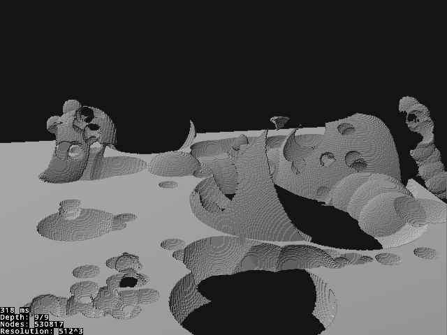
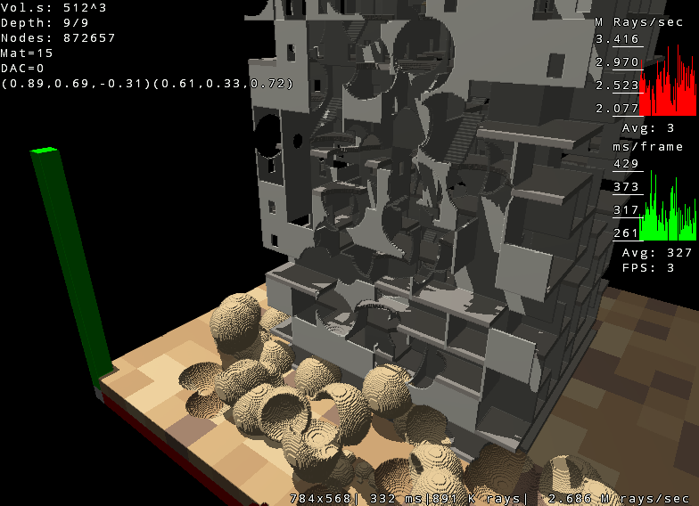
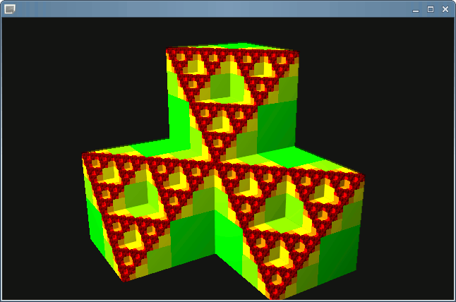
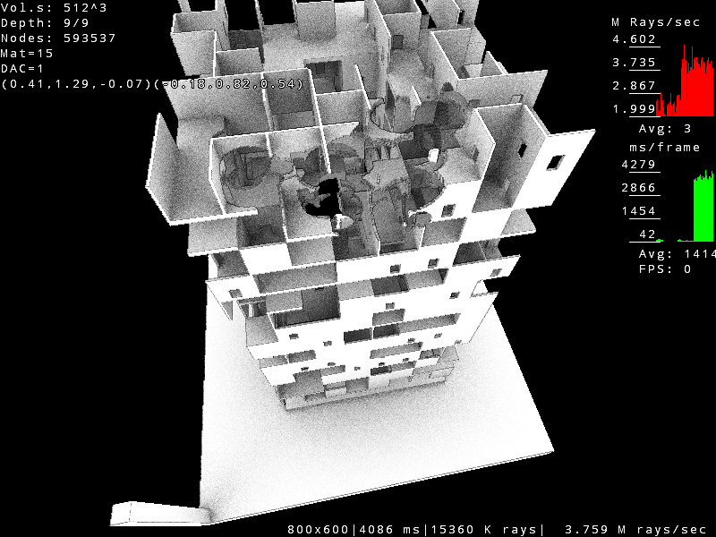
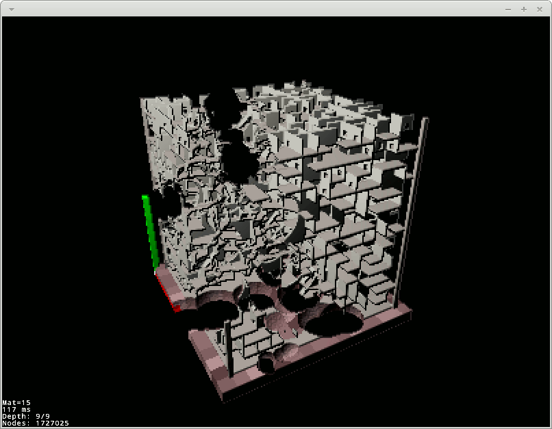
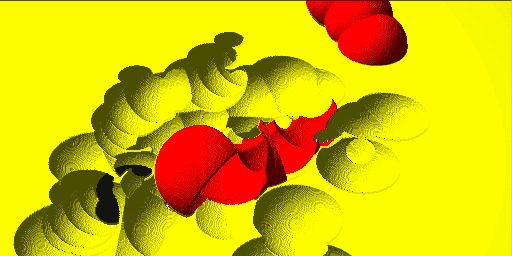

# voxelsddademo
A graphical demo of software raycasting a 512x512x512 voxel volume.
99% of work done in 2012-2014 and since then the project has just sat on my hard drive.
Uploaded to Github 27/05/2020.

- Arho Mahlamäki
